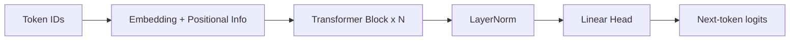

# Transformer Architecture: A Detailed Note

> Transformer is the core architecture for modern NLP and large language model systems. This note explains structure, equations, training, and engineering optimizations.

## 1. Why Transformer

RNN/LSTM models have natural bottlenecks for long-range dependency modeling and parallel training:

- Long gradient propagation paths
- Strong step-by-step sequential dependency in computation

Transformer addresses both with attention-based global interaction and hardware-friendly parallelism.

## 2. Macro Architecture

Common forms:

- Encoder-only (e.g., BERT) for understanding tasks
- Decoder-only (e.g., GPT) for autoregressive generation
- Encoder-Decoder (e.g., original Transformer, T5) for conditional generation

For modern autoregressive LLMs, Decoder-only is the dominant choice.

A typical block contains:

1. Multi-Head Self-Attention
2. Feed-Forward Network (FFN)
3. Residual connections
4. Normalization (LayerNorm or RMSNorm)

## 3. Input Representation: Embedding + Position

Token embeddings map ids to vectors:

$$
X \in \mathbb{R}^{T \times d_{model}}
$$

Without positional information, sequence order is lost. Common positional mechanisms:

- Sinusoidal absolute position encoding
- Learnable position embedding
- RoPE (widely used in modern LLMs)

Sinusoidal form:

$$
PE_{(pos,2i)}=\sin\left(\frac{pos}{10000^{2i/d_{model}}}\right),\quad
PE_{(pos,2i+1)}=\cos\left(\frac{pos}{10000^{2i/d_{model}}}\right)
$$

## 4. Self-Attention

From input $X$, project to:

$$
Q=XW_Q,\quad K=XW_K,\quad V=XW_V
$$

Scaled dot-product attention:

$$
\text{Attention}(Q,K,V)=\text{softmax}\left(\frac{QK^\top}{\sqrt{d_k}} + M\right)V
$$

where $M$ is a mask:

- Padding mask ignores padded positions
- Causal mask blocks future tokens in autoregressive decoding

## 5. Multi-Head Attention

Multiple heads capture different relational subspaces:

$$
\text{head}_i=\text{Attention}(Q_i,K_i,V_i),\quad
\text{MHA}=\text{Concat}(\text{head}_1,\ldots,\text{head}_h)W_O
$$

In practice, different heads often focus on syntax, entities, locality, and long-range semantics.

## 6. Feed-Forward Network

Attention mixes information across tokens; FFN applies non-linear transformation per position:

$$
\text{FFN}(x)=W_2\,\sigma(W_1x+b_1)+b_2
$$

Modern variants often use SwiGLU/GELU for stronger efficiency-quality tradeoffs.

## 7. Residual and Normalization

Pre-Norm block form:

$$
h' = h + \text{MHA}(\text{Norm}(h))
$$

$$
h'' = h' + \text{FFN}(\text{Norm}(h'))
$$

Pre-Norm is typically more stable than Post-Norm in very deep stacks.

## 8. Training and Inference

### 8.1 Autoregressive Objective

For decoder-only LMs:

$$
\mathcal{L}=-\sum_{t=1}^{T}\log p(x_t\mid x_{<t})
$$

### 8.2 KV Cache in Decoding

At generation time, each step adds one token. Caching historical K/V avoids recomputing all previous states:

- Reduces repeated compute
- Improves long-context throughput

## 9. Common Engineering Upgrades

- Position handling: RoPE / ALiBi
- Normalization: LayerNorm -> RMSNorm
- FFN activation: ReLU/GELU -> SwiGLU
- Attention kernel: FlashAttention
- KV efficiency: MQA / GQA
- Stability: warmup, clipping, weight decay
