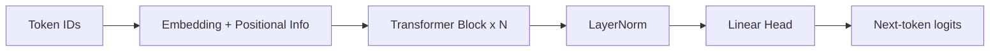

# Transformer 架构详解

> 当前 NLP 与大模型系统的核心骨架。本文从结构、公式、训练与工程优化四个层面给出系统说明。

## 1. 为什么是 Transformer

RNN/LSTM 在长程依赖和并行计算上存在天然瓶颈：

- 依赖链长，梯度传播路径长。
- 时间步串行，训练吞吐受限。

Transformer 通过注意力机制让任意位置直接交互，并支持大规模并行计算，成为现代语言模型的标准架构。

## 2. 总体结构

Transformer 有三种常见形态：

- Encoder-only：例如 BERT，偏理解任务。
- Decoder-only：例如 GPT，偏生成任务。
- Encoder-Decoder：例如原始 Transformer/T5，偏条件生成任务。

对于自回归 LLM，最常用的是 Decoder-only 结构。

每个 Block 典型包含：

1. 多头自注意力 Multi-Head Self-Attention
2. 前馈网络 Feed-Forward Network
3. 残差连接 Residual Connection
4. 归一化 LayerNorm/RMSNorm

## 3. 输入表示：Embedding 与位置编码

词向量将 token id 映射到连续空间：

$$
X \in \mathbb{R}^{T \times d_{model}}
$$

仅靠词向量无法表达顺序，需要注入位置信息。

常见做法：

- 绝对位置编码（正弦余弦）
- 可学习位置向量
- RoPE（旋转位置编码，LLM 常用）

正弦余弦位置编码形式：

$$
PE_{(pos,2i)}=\sin\left(\frac{pos}{10000^{2i/d_{model}}}\right),\quad
PE_{(pos,2i+1)}=\cos\left(\frac{pos}{10000^{2i/d_{model}}}\right)
$$

## 4. 自注意力机制

对输入 $X$ 线性映射得到：

$$
Q=XW_Q,\quad K=XW_K,\quad V=XW_V
$$

缩放点积注意力：

$$
\text{Attention}(Q,K,V)=\text{softmax}\left(\frac{QK^\top}{\sqrt{d_k}} + M\right)V
$$

其中 $M$ 是 mask：

- Padding Mask：忽略补齐位。
- Causal Mask：在自回归中屏蔽未来 token。

## 5. 多头注意力

将通道分成多个 head 并行学习不同关系：

$$
\text{head}_i=\text{Attention}(Q_i,K_i,V_i),\quad
\text{MHA}=\text{Concat}(\text{head}_1,\ldots,\text{head}_h)W_O
$$

多头机制通常能同时捕捉语法依赖、实体关系与远程语义关联。

## 6. 前馈网络 FFN

注意力负责 token 间信息交互，FFN 负责位置内非线性变换：

$$
\text{FFN}(x)=W_2\,\sigma(W_1x+b_1)+b_2
$$

现代变体常见使用 SwiGLU/GELU 提升表达效率。

## 7. 残差与归一化

标准块结构（Pre-Norm 形式）可写为：

$$
h' = h + \text{MHA}(\text{Norm}(h))
$$

$$
h'' = h' + \text{FFN}(\text{Norm}(h'))
$$

Pre-Norm 在深层网络中通常比 Post-Norm 更稳定。

## 8. 训练目标与推理方式

### 8.1 自回归训练

Decoder-only 语言模型常用 next-token prediction：

$$
\mathcal{L}=-\sum_{t=1}^{T}\log p(x_t\mid x_{<t})
$$

### 8.2 推理与 KV Cache

生成阶段每步只新增一个 token。为避免重复计算历史 Key/Value，缓存历史 K/V：

- 降低重复计算。
- 提升长文本生成吞吐。

复杂度直观上从“每步重算全序列”转为“增量更新 + 读取缓存”。

## 9. 工程侧常见改进

结合课程与工程实践，现代 Transformer 常见优化包括：

- 位置编码：RoPE/ALiBi 增强长度外推。
- 归一化：LayerNorm -> RMSNorm。
- FFN 激活：ReLU/GELU -> SwiGLU。
- 注意力实现：FlashAttention 降低显存带宽瓶颈。
- 多查询机制：MQA/GQA 降低推理 KV 成本。
- 训练稳定性：梯度裁剪、学习率 warmup、权重衰减。